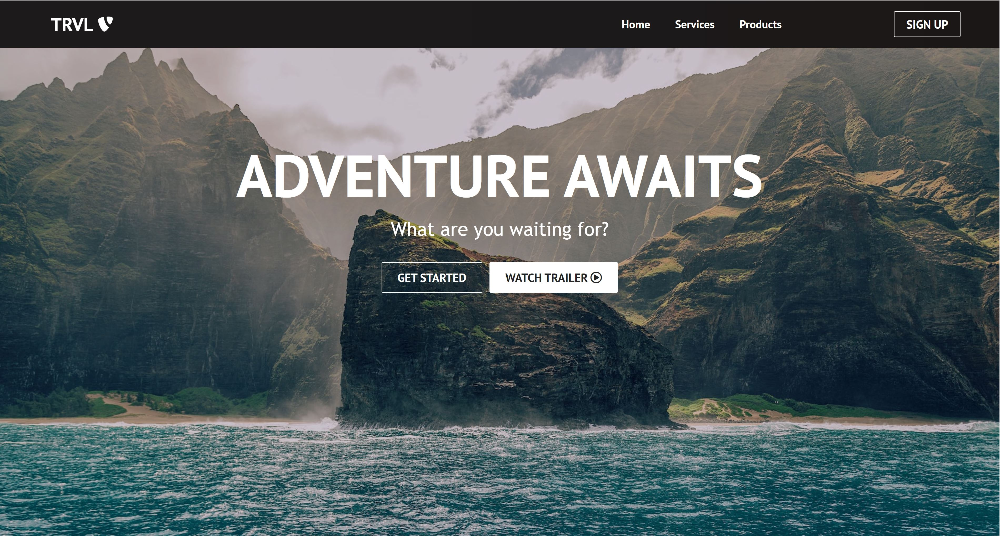
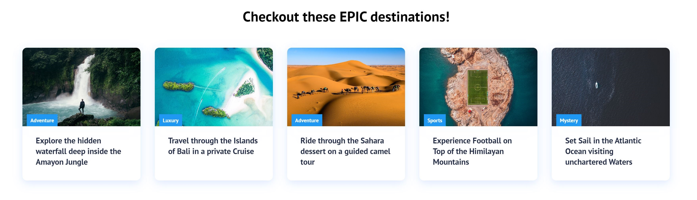
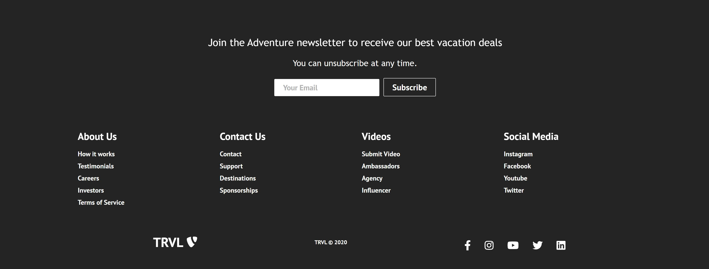

# Travel Website

This is a project created with the purpose of learning React, a popular JavaScript library for building user interfaces. The project is a travel website for exploring and planning your next travel.
It serves as a practical application of the concepts and techniques taught in [React Website Tutorial - Beginner React JS Project Fully Responsive](https://youtu.be/I2UBjN5ER4s).

## Features

- Browse and discover various travel destinations.
- View detailed information about each destination, including descriptions and images.
- User-friendly interface with intuitive navigation.

## Getting Started

1. **Clone the repository**: Start by cloning this repository to your local machine using the command `git clone <repository-url>`.

2. **Install dependencies**: Navigate to the project's root directory and run `npm install` to install the necessary dependencies.

3. **Run the development server**: Start the development server by running `npm run dev`. This will launch the application in your default browser.

4. **Build for production**: When you're ready to build your project for production, run `npm run build`. This will create an optimized and minified version of your application in the dist directory.

## Preview

To give you a glimpse of this project, let's take a look at some screenshots showcasing its powerful features.

### Screenshot 1: Landing Page (Navbar and Hero Section)

### Screenshot 2: Travel Cards

### Screenshot 3: Footer

